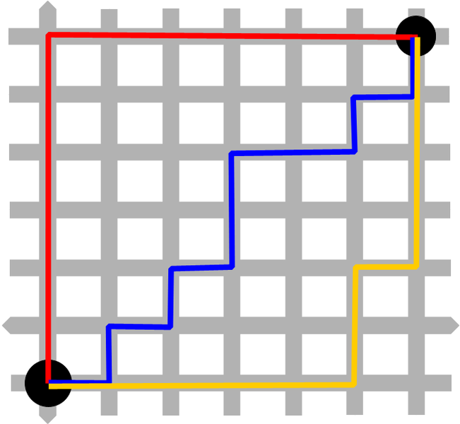

[subs=+macros]
[source,asciidoc]
= Informed Search

* Heuristics

They were a relevant parameter for our project. On Informed Search algorithms they are accounted within the path cost to serve as an evaluation that our agent will use to choose the next step it will take, the next action, and help to find a solution (sometimes optimal sometimes not) to our problem.
For the Pacman Maze problem, our heuristics worked around finding the action that would take the agent to a less distant point to the goal.
Searching on the bibliography and the internet we found two approaches taken on problems like these.

** Manhattan Distance

Based on the "real" distance that the agent will travel. Considers the corners to be taken, like a count of steps. 
It was necessary a little cost over the processing of it on each neighbor of the current node we were analyzing.

----
   # Calcula a distancia entre duas posicoes, valido apenas para posicoes que fazem parte da sol
    @functools.lru_cache(maxsize=4096)
    def manhattan_distance(self, position1, position2, lim=100000):
        if position1 == position2:
            return 0

        # dicicionario com formato { item: [distancia, visitado (0 = nao, 1 = sim)], ... }
        d = dict.fromkeys(self.reachable_positions(position1), [math.inf, 0])
        d[position1] = [0, 0]

        i = 0
        while min({l[1] for l in d.values()}) == 0 and i < lim:
            m = math.inf
            current = None
            for k, v in d.items():
                if v[1] == 0 and v[0] < m:
                    current = k
                    m = v[0]

            d[current] = [m, 1]

            neighbors = self.adjacent(current)
            for neighbor in neighbors:
                if d[neighbor][1] == 0 and m + 1 < d[neighbor][0]:
                    d[neighbor] = [m + 1, 0]
                    if neighbor == position2:
                        return m + 1

            current = None
            i = i + 1

        try:
            return d[position2][0]
        except KeyError:
            return math.inf
----

O algoritmo acima checa a *distância de manhattan* entre dois pontos.
Inicialmente, ele checa se os pontos passados se referem a mesma posição, em caso positivo, já temos nossa resposta! (e nos poupa um bom processamento). Em caso negativo manhattan_distance usa uma função auxiliar (_reachable_positions_) que nos retorna um dicionário onde dada a chave (coordenadas da respectiva posição) temos um valor (uma lista [distancia, visitado]).
Enquanto não existir elementos ainda não visitados, avaliamos o *mais próximo* dentre estes,  da posição corrente da nossa busca.

Com esse nó avaliado no loop, para cada posição adjacente não avaliada, incrementa-se a distância respectiva.

Esse processo continua até que se visite a posição dada por _position2_ 

Ou seja, em resumo, simulamos os passos a serem dados para nosso agente chegar de um ponto A (_position1_) a um ponto B (_position2_) e projetamos o menor caminho possível, sustentado pela estratégia de que iniciamos cada uma das "buscas parciais" do nó com a menor distância, nos termos de manhattan, a cada iteração.

** Euclidean Distance
    
----
      def euclidean_distance(self, position1, position2):
        if self.reachable(position1, position2) is False:
            return math.inf
        
        deltaX1 = (position2[0] - position1[0])**2
        deltaY1 = (position2[1] - position1[1])**2
        return (deltaX1 + deltaY1)**0.5
----

Essa heurística é bem mais direta em termos de lógica e processamento de dados. 

A distância euclidiana avalia simplismente, a distância em linha reta, do ponto A ao ponto B, que no caso de nosso algoritmo de busca seriam o ponto de avaliação atual ao goal.

Em primeiro lugar, checamos se os dois pontos são alcançáveis. Se sim, calculamos a distância segundo a fórmula de Euclides:

asciimath:[sqrt((x - x)² + (y - y)²)]

** Algorithm

** State Representation

** Node Expansion

** Goal Test

** Complexity

** Behaviour

    

        

